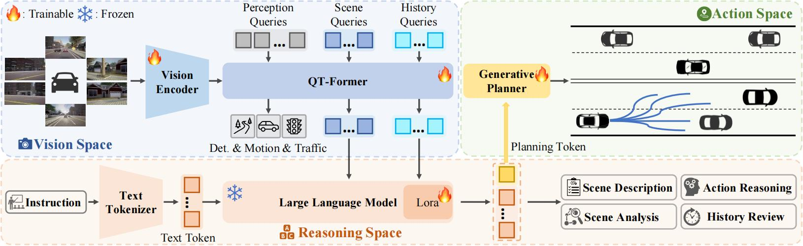

# ORION: A Holistic End-to-End Autonomous Driving Framework by Vision-Language Instructed Action Generation


<a href="https://arxiv.org/abs/2503.19755"></a>
<a href="https://xiaomi-mlab.github.io/Orion/"></a>

<!-- ## Introduction -->


End-to-end (E2E) autonomous driving methods still struggle to make correct decisions in interactive closed-loop evaluation due to limited causal reasoning capability. Current methods attempt to leverage the powerful understanding and reasoning abilities of Vision-Language Models (VLMs) to resolve this dilemma.  However, the problem is still open that few VLMs for E2E methods perform well in the closed-loop evaluation due to the gap between the semantic reasoning space and the purely numerical trajectory output in the action space. To tackle this issue, we propose **ORION**, a h**O**listic E2E autonomous d**R**iving framework by v**I**sion-language instructed acti**ON** generation.
ORION uniquely combines a QT-Former to aggregate long-term history context, a Large Language Model (LLM) for driving scenario reasoning, and a generative planner for precision trajectory prediction. ORION further aligns the reasoning space and the action space to implement a unified E2E optimization for both visual question-answering (VQA) and planning tasks. Our method achieves an impressive closed-loop performance of 77.74 Driving Score (DS) and 54.62\% Success Rate (SR) on the challenge Bench2Drive datasets, which outperforms state-of-the-art (SOTA) methods by a large margin of 14.28 DS and 19.61\% SR.


<div align="center">

</div>

## News
`[2025/04/10]` ORION inference code and checkpoint release.

`[2025/03/26]` [ArXiv](https://arxiv.org/abs/2503.19755) paper release.

## Currently Supported Features

- [x] ORION Inference Framework
- [x] Open-loop Evaluation
- [x] Close-loop Evalution
- [x] ORION Checkpoint
- [ ] Chat-B2D Dataset 
- [ ] ORION Training Framework


## Getting Started

```
git clone https://github.com/xiaomi-mlab/Orion.git
cd ./ORION
conda create -n orion python=3.8 -y
conda activate orion
pip install torch==2.4.1+cu118 torchvision==0.19.1+cu118 torchaudio==2.4.1 --index-url https://download.pytorch.org/whl/cu118
pip install -v -e .
pip install -r requirements.txt

```


## Preperation
You can refer to [here](https://github.com/Thinklab-SJTU/Bench2DriveZoo/blob/uniad/vad/docs/DATA_PREP.md) to prepare the Bench2drive dataset.

ORION uses the pretrained [2D llm weights](https://huggingface.co/exiawsh/pretrain_qformer/) and [vision encoder + projector weights](https://github.com/NVlabs/OmniDrive/releases/download/v1.0/eva02_petr_proj.pth) provided by [Omnidrive](https://github.com/NVlabs/OmniDrive/tree/main)
```
cd /path/to/OmniDrive
mkdir ckpts
```
The vision encoder + projector weights are extracted from ckpts/pretrain_qformer/, which is pretrained by using llava data.


## Open-loop evaluation

You can perform an open-loop evaluation of ORION with the following command

``` 
./adzoo/orion/orion_dist_eval.sh adzoo/orion/configs/orion_stage3.py [--PATH_CHECKPOINTS] 1
```

You also can perform a CoT inference of ORION with (this might be quite slow)

``` 
./adzoo/orion/orion_dist_eval.sh adzoo/orion/configs/orion_stage3_cot.py [--PATH_CHECKPOINTS] 1
```

We recommend inference for ORION on an NVIDIA A100 or other GPUs with more than **32GB** of memory (inference in fp32, as default).


## Close-loop evaluation

You can refer to [here](https://github.com/Thinklab-SJTU/Bench2Drive) to clone Bench2Drive evaluation tools and prepare CARLA for it.

Follow [here](https://github.com/Thinklab-SJTU/Bench2Drive?tab=readme-ov-file#eval-tools) to use evaluation tools of Bench2Drive.

Note that you may first verify the correctness of the team agent， you need to set GPU_RANK, TEAM_AGENT, TEAM_CONFIG in the eval scripts.

You can set as following for close-loop evaluation 
```
TEAM_CONFIG=adzoo/orion/configs/orion_stage3_agent.py+[CHECKPOINT_PATH]
```

## Results and Checkpoints

### Orion and other baselines
The results of UniAD & VAD are refer to the official results of [Bench2DriveZoo](https://github.com/Thinklab-SJTU/Bench2DriveZoo)

| Method | L2 (m) 2s | Driving Score | Success Rate(%) | Config | Download | Eval Json|
| :---: | :---: | :---: | :---: |  :---: | :---: | :---: |
| UniAD-Tiny |0.80 | 40.73 |  13.18 | [config](https://github.com/Thinklab-SJTU/Bench2DriveZoo/tree/uniad/vad/adzoo/uniad/configs/stage2_e2e/base_e2e_b2d.py) | [Hugging Face](https://huggingface.co/rethinklab/Bench2DriveZoo/blob/main/uniad_tiny_b2d.pth)/[Baidu Cloud](https://pan.baidu.com/s/1psr7AKYHD7CitZ30Bz-9sA?pwd=1234 )| [Json](assets/results/UniAD-Tiny.json) |
| UniAD-Base |0.73 | 45.81  |  16.36 | [config](https://github.com/Thinklab-SJTU/Bench2DriveZoo/tree/uniad/vad/adzoo/uniad/configs/stage2_e2e/tiny_e2e_b2d.py) | [Hugging Face](https://huggingface.co/rethinklab/Bench2DriveZoo/blob/main/uniad_base_b2d.pth)/[Baidu Cloud](https://pan.baidu.com/s/11p9IUGqTax1f4W_qsdLCRw?pwd=1234) | [Json](assets/results/UniAD-Base.json) |
| VAD        |0.91 | 42.35  | 15.00 | [config](https://github.com/Thinklab-SJTU/Bench2DriveZoo/tree/uniad/vad/adzoo/vad/configs/VAD/VAD_base_e2e_b2d.py) | [Hugging Face](https://huggingface.co/rethinklab/Bench2DriveZoo/blob/main/vad_b2d_base.pth)/[Baidu Cloud](https://pan.baidu.com/s/1rK7Z_D-JsA7kBJmEUcMMyg?pwd=1234) | [Json](assets/results/VAD.json) |
| ORION       |0.68 | 77.74  | 54.62 | [config](adzoo/orion/configs/orion_stage3.py) | [Hugging Face](https://huggingface.co/poleyzdk/Orion/blob/main/Orion.pth)| [Json](assets/results/ORION.json) |


## Qalitative visualization & Analysis
We provide some visualization videos and qualitatively analysis for Orion and compared them with TCP-traj, UniAD-Base, VAD-Base at [here](docs/analysis.md). 


## Citation
If this work is helpful for your research, please consider citing:

```
@article{fu2025orion,
  title={ORION: A Holistic End-to-End Autonomous Driving Framework by Vision-Language Instructed Action Generation},
  author={Haoyu Fu and Diankun Zhang and Zongchuang Zhao and Jianfeng Cui and Dingkang Liang and Chong Zhang and Dingyuan Zhang and Hongwei Xie and Bing Wang and Xiang Bai},
  journal={arXiv:2503.19755},
  year={2025}
}
```

